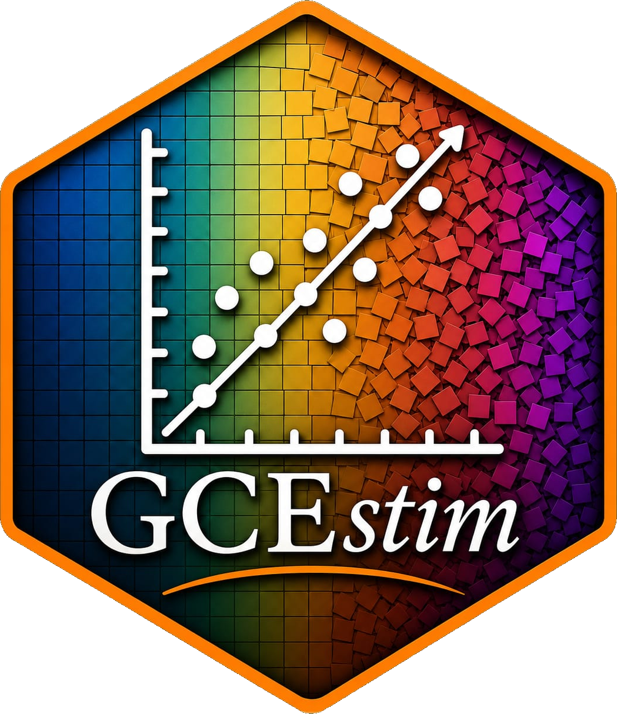

# GCE 

GCEstim: Generalized Cross Entropy linear models in R.
====

<!-- badges: start -->
[](https://cran.r-project.org/package=GCEstim)
[](https://cran.r-project.org/package=GCEstim)
<!-- badges: end -->

## Recent/release notes

* Major updates.

## Features

* Estimates linear regression coefficients using Generalized Cross Entropy.

## Overview

GCEstim provides tools for estimating linear regression models using
Generalized Cross Entropy (GCE) and related information-theoretic
estimators. The package is particularly useful in situations involving
multicollinearity, small sample sizes, ill-conditioned design matrices,
or when prior information is available.

The package includes estimation, model selection, support-space
construction, cross-validation, bootstrap inference, and diagnostic
tools.

## Examples

```r
res.lmgce.v01 <-
  lmgce(
    formula = y ~ X001 + X002 + X003 + X004,
    data = dataThesis,
    boot.B = 100,
    boot.method = "residuals")

summary(res.lmgce.v01)
plot(res.lmgce.v01)
```

## Installation

* Development version from Github:
```
devtools::install_github("jorgevazcabral/GCEstim",
                         build_vignettes = TRUE,
                         build_manual = TRUE,
                         dependencies=TRUE)
```

* Stable version from CRAN:
```
install.packages("GCEstim")
```

## Development Status

GCEstim is under active development.
Bug reports, feature requests, and pull requests are welcome through GitHub 
Issues.

## Links

* CRAN: https://cran.r-project.org/package=GCEstim
* GitHub: https://github.com/jorgevazcabral/GCEstim
* Issues: https://github.com/jorgevazcabral/GCEstim/issues

## References

Golan, Judge and Miller (1996).
Maximum Entropy Econometrics.

Golan (2018).
Foundations of Info-Metrics.

Cabral et al. (2025).
GCEstim: Regression Coefficients Estimation Using the Generalized Cross Entropy.

## Citation

In case you want / have to cite this package, please use `citation('GCEstim')` for citation information.
