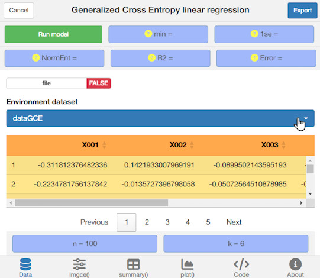
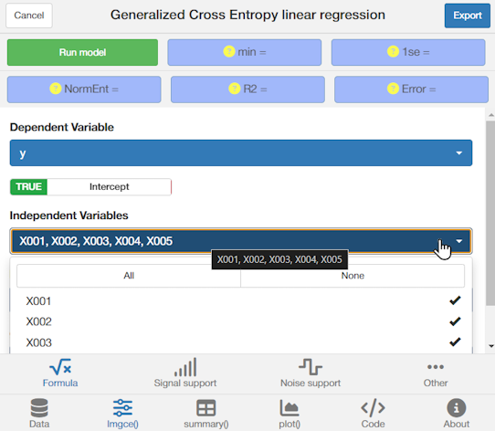
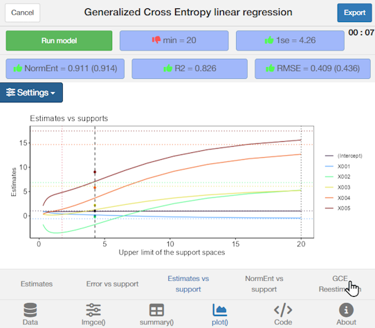
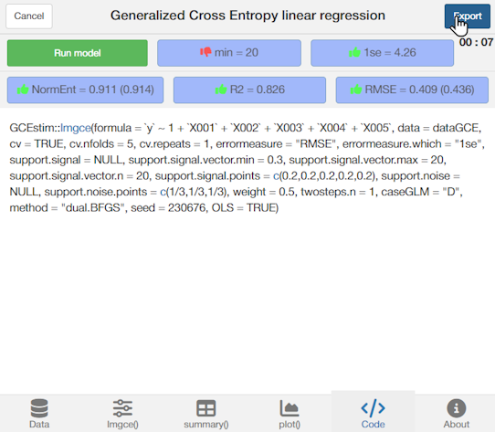

```{r, include = FALSE}
knitr::opts_chunk$set(
  collapse = TRUE,
  comment = "#>"
)
```

<center></center>

## Introduction

In this vignette, the theoretical considerations are skipped and simple examples 
of several `GCEstim` functions are given.

## lmgce()

Consider `dataThesis` (see ["Generalized Maximum Entropy
framework"](V2_GME_framework.html#Examples)).

```{r,echo=FALSE,eval=TRUE,message=FALSE}
library(GCEstim)
load("GCEstim_Quick_start.RData")
```

```{r,echo=FALSE,eval=TRUE}
summary(dataThesis)
```

```{r,echo=FALSE,eval=TRUE, fig.width=5,fig.height=5,fig.align='center'}

panel.hist <- function(x, ...) {
  usr <- par("usr")
  on.exit(par(usr = usr))

  par(usr = c(usr[1:2], 0, 1.5))

  h <- hist(x, plot = FALSE)
  y <- h$counts / max(h$counts)

  rect(
    h$breaks[-length(h$breaks)], 0,
    h$breaks[-1], y,
    col = "lightgray",
    border = "white"
  )
}

pairs(
  dataThesis,
  upper.panel = NULL,
  diag.panel = panel.hist,
  lower.panel = panel.smooth
)
```

Suppose we want to obtain the estimates for the model

\begin{equation}
    \mathbf{y}=\beta_0\mathbf{1}_N + \beta_1\mathbf{X001} + \beta_2\mathbf{X002} + \beta_3\mathbf{X003} + \beta_4\mathbf{X004}.
\end{equation}

Using the function `lmgce()` and setting:

-   `formula = y ~ X001 + X002 + X003 + X004`

-   `data = dataThesis`

the desired model is computed in a Two-stage Adaptive Standardized-coefficients-informed Weighted Generalized Cross Entropy (TASW-GCE) Framework. In particular, with 5 points for the signal support space, 3 points for the noise support space, a weight of 0.5 and uniform priors for both signal and support (`help("lmgce")`).

```{r,echo=TRUE,eval=TRUE}
res.lmgce.v01 <-
  lmgce(
    formula = y ~ X001 + X002 + X003 + X004,
    data = dataThesis)
```

If we would like to see a concise summary of the result we can simply type,

```{r,echo=TRUE,eval=TRUE}
res.lmgce.v01
```

To obtain a more detailed evaluation of the fitted model, we can use `summary()`

```{r,echo=TRUE,eval=TRUE}
summary(res.lmgce.v01)
```

The estimated GCE coefficients are $\widehat{\boldsymbol{\beta}}^{TASW\text{-}GCE}=$
`r paste0("(", paste(round(coef(res.lmgce.v01), 3), collapse = ", "), ")")`.

```{r,echo=TRUE,eval=TRUE}
(coef.res.lmgce.v01 <- coef(res.lmgce.v01))
```

The prediction root mean squared error (RMSE) is $RMSE^{ y, TASW\text{-}GCE} \approx$
`r round(res.lmgce.v01$error.measure, 3)`.

```{r,echo=TRUE,eval=TRUE}
res.lmgce.v01$error.measure
```

The prediction 5-fold cross-validation (CV) error is
$CV\text{-}RMSE^{y,TASW\text{-}GCE} \approx$
`r round(res.lmgce.v01$error.measure.cv.mean, 3)`.

```{r,echo=TRUE,eval=TRUE}
res.lmgce.v01$error.measure.cv.mean
```

Z-score confidence intervals (CIs) are obtained with the `confint` S3 method for
class `lmgce`

```{r,echo=TRUE,eval=TRUE}
confint(res.lmgce.v01, level = 0.95)
```

and can be visualized with `plot`

```{r,echo=TRUE,eval=TRUE, fig.width=6,fig.height=4}
plot(res.lmgce.v01, which = 1)$p1
```

Color-filled dots represent the GCE estimates while non-filled dots represent the 
OLS estimates (`lmgce` uses by default `OLS = TRUE`).  

Bootstrap CIs are available by setting `method = "percentile"` or
`method = "basic"`, defining a number of replicates `boot.B = 1000` and bootstrap
method (three methods available, see `help("confint.lmgce")`)

```{r,echo=TRUE,eval=FALSE}
res.lmgce.v01.confint <- 
  confint(
    res.lmgce.v01,
    level = 0.95,
    method = "basic",
    boot.B = 100,
    boot.method = "residuals"
  )
```

```{r,echo=TRUE,eval=TRUE}
res.lmgce.v01.confint
```

or 

```{r,echo=TRUE,eval=TRUE}
res.lmgce.v02 <-
  update(res.lmgce.v01,
         boot.B = 100,
         boot.method = "residuals")
```

```{r,echo=TRUE,eval=TRUE}
res.lmgce.v02.confint <-
  confint(
    res.lmgce.v02,
    level = 0.95,
    method = "basic"
  )
```

```{r,echo=TRUE,eval=TRUE}
res.lmgce.v02.confint
```

```{r,echo=TRUE,eval=TRUE, fig.width=6,fig.height=4,fig.align='center'}
plot(res.lmgce.v02, which = 1, ci.method = "basic")$p1
```

From the previous summary we can see that the standardized parameter chosen was `r res.lmgce.v01$support.stdUL`

```{r,echo=TRUE,eval=TRUE, fig.width=6,fig.height=4}
res.lmgce.v01$support.stdUL
```

and corresponds to the support spaces which cross-validation RMSE (CV-RMSE) is 
not greater than the minimum CV-RMSE plus one standard error (1se)

```{r,echo=TRUE,eval=TRUE, fig.width=6,fig.height=4}
res.lmgce.v01$support.signal.1se
```

During estimation, standardized limits are reverted to the original scale

```{r,echo=TRUE,eval=TRUE, fig.width=6,fig.height=4}
res.lmgce.v01$support.matrix #original scale
```

`lmgce` uses by default `support.signal = NULL` and 
`support.signal.vector = NULL` meaning that it will evaluate the 
`errormeasure = "RMSE"` with cross-validation 
(`cv = TRUE`, `cv.nfolds = 5`) in a set of 
`support.signal.vector.n = 20` supports spaces logarithmically between 
`support.signal.vector.min = 0.3` and `support.signal.vector.min = 20`. It will 
then choose the minimum, one standard error or elbow error (see `help("lmgce")`).    

```{r,echo=TRUE,eval=TRUE, fig.width=6,fig.height=4,fig.align='center'}
plot(res.lmgce.v01, which = 2)$p2
```

Red dots represent the CV-error and green dots the CV-Normalized entropy.
Whiskers have the length of two standard errors of the CV mean for each of the 
20 support spaces tested.
The dotted horizontal line is the OLS CV-error. The black vertical dotted line 
corresponds to the support spaces that produced the lowest CV-error. The black
vertical dashed line corresponds to the support spaces that produced the 1se 
CV-error. The red vertical dotted line corresponds to the support spaces that 
produced the elbow CV-error.

With `plot` it is possible to obtain the trace of the estimates

```{r,echo=TRUE,eval=TRUE, fig.width=6,fig.height=4,fig.align='center'}
plot(res.lmgce.v01, which = 3)$p3
```

In the last two plots are depicted the final solutions. That is to say
that after choosing the support spaces limits based on the defined error, 
the number of points of the support spaces and their probability 
`support.signal.points = c(1/5, 1/5, 1/5, 1/5, 1/5)` and 
`support.signal.points = c(1/3, 1/3, 1/3)`, `twosteps.n = 1` extra 
estimation(s) is(are) performed. This estimation uses the GCE framework even if 
the previous steps were by default on the GME framework.
The distribution of probabilities used is the one estimated for the chosen 
support spaces.

```{r,echo=TRUE,eval=TRUE, fig.width=6,fig.height=4}
res.lmgce.v01$p0
res.lmgce.v01$w0[1:5, ] # for the first 5 lines
```

The trace of the CV-error with the reestimations can be obtained with `plot`

```{r,echo=TRUE,eval=TRUE, fig.width=6,fig.height=4,fig.align='center'}
plot(res.lmgce.v01, which = 6)$p6
```

The pre reestimation CV-error is depicted by the red dot and final/reestimated 
CV-error corresponds to the dark red dot. The horizontal dotted line represents 
again the OLS CV-error. The final estimated vectors of probabilities is

```{r,echo=TRUE,eval=TRUE, fig.width=6,fig.height=4}
res.lmgce.v01$p
res.lmgce.v01$w[1:5, ]
```

After looking at the results and traces we may feel the need to select a different
support, lets say the minimum. That can obviously be done using, for instance

```{r,echo=TRUE,eval=FALSE}
lmgce(y ~ X001 + X002 + X003 + X004,
      data = dataThesis,
      errormeasure.which = "min")
#or
update(res.lmgce.v01, errormeasure.which = "min")
```

but that implies a complete reestimation and can be very time-costly.
Since the results of all the evaluated support spaces are stored, choosing a 
different support should be done with `changesupport`

```{r,echo=TRUE,eval=TRUE, fig.width=6,fig.height=4}
res.lmgce.v01.min <- changesupport(res.lmgce.v01, "min")
```

```{r,echo=TRUE,eval=TRUE, fig.width=6,fig.height=4}
summary(res.lmgce.v01.min)
```

```{r,echo=TRUE,eval=TRUE, fig.width=6,fig.height=4}
plot(res.lmgce.v01.min)
```

Note that the GCE estimates are now "closer" to the OLS estimates.\
In this example the true coefficients are known and we can also observe that the
`1se` approach gives estimates "closer" to those coefficients.


```{r,echo=TRUE,eval=TRUE, fig.width=6,fig.height=4}
data.frame("Supp_1se" = coef(res.lmgce.v01),
           "Supp_min" = coef(res.lmgce.v01.min),
           "OLS" = coef(res.lmgce.v01$results$OLS$res),
           "TRUE" = coef.dataThesis)
```

Several generic functions can used with `lmgce` class objects, for instance

```{r,echo=TRUE,eval=TRUE, fig.width=6,fig.height=4}
fitted(res.lmgce.v01)[1:5]
```

```{r,echo=TRUE,eval=TRUE, fig.width=6,fig.height=4}
predict(res.lmgce.v01, dataGCE[1,])
```

<br>

## lmgceAddin()

An add-in to easily generate the R code for a `lmgce` analysis and to perform 
that analysis can be accessed with

```{r,echo=TRUE,eval=FALSE}
lmgceAddin()
``` 

Data can be imported from a file or be called from the `Environment`.

<br>

<center></center>

<br>

The parameters of `lmgce()` can be changed.

<br>

<center></center>

<br>

Several outputs can be visualized.

<br>

<center></center>

<br>

The expression for `lmgce()` can be exported.

<br>

<center></center>

<br>

## cv.lmgce()

`lmgce()` allows for the evaluation of several support spaces and, given a certain 
criterion, selects one of them. But GCE estimation is also sensitive to the number of
points of the signal and noise support spaces and to the weight that each of the spaces 
has in the loss function. `cv.lmgce()` tests the combination of these parameters. 

```{r,echo=TRUE,eval=FALSE}
res.cv.lmgce <-
  cv.lmgce(
    y ~ X001 + X002 + X003 + X004,
    data = dataThesis,
    support.signal.points = c(3, 5, 7),
    support.noise.points = c(3, 5, 7),
    weight = c(0.1, 0.5, 0.9))
```

```{r,echo=TRUE,eval=TRUE}
res.cv.lmgce
```

It returns CV-errors, convergence of the optimization algorithm (0 means that 
convergence was obtained) and time.

```{r,echo=TRUE,eval=TRUE}
res.cv.lmgce$results[order(res.cv.lmgce$results$error.measure.cv.mean),][1:10,-6] 
```

The model with the combination that produces the lowest CV-error is kept.

```{r,echo=TRUE,eval=TRUE}
summary(res.cv.lmgce$best)
```

Using `plot` we obtain

```{r,echo=TRUE,eval=TRUE,fig.width=6,fig.height=4,fig.align='center'}
plot(res.cv.lmgce, which = 1, ncol = 3)$p1 + ggplot2::ylim(0.96, 1.08) 
```

## tsbootgce()

Consider the time series in the `ts` object `moz_ts`.

```{r,echo=TRUE,eval=TRUE,fig.width=6,fig.height=6,fig.align='center'}
plot(moz_ts)
```

Let:

-   $CO2_t$ be the emissions of $CO_2$ at time $t$;

-   $EPC_{t-1}$ be the energy per capita at time $t-1$;

-   $EUS_{t-2}$ be the energy use at time $t-2$.

-   $GDP_{t}$ be the gross domestic product at time $t$;

Let us obtain the estimated model

\begin{equation}
    CO2_t=\beta_0 + \beta_1 EPC_{t-1} + \beta_2 EUS_{t-2} + \beta_3 GDP_{t-1}
\end{equation}


Using the function `tsbootgce()` and setting:

-   `formula = CO2 ~ 1 + L(EPC, 1) + L(EUS, 2) + L(GDP, 0)`

-   `data = moz_ts`

the desired model is computed. `formula` allows additional functions 
available in R package [dynlm](https://CRAN.R-project.org/package=dynlm)). 

```{r,echo=TRUE,eval=FALSE}
res.tsbootgce <- 
  tsbootgce(
    formula = CO2 ~ 1 + L(EPC, 1) + L(EUS, 2) + L(GDP, 0),
    data = moz_ts
    )
```

Note that by default `tsbootgce` uses `reps = 1000` replicates as elements of an 
ensemble, which retain the shape of the original time series, as well as the
time dependence structure of the autocorrelation and the partial autocorrelation
functions. The `plot` function can give us pointwise percentile envelopes
(red, green and blue areas) and the median distribution (dashed yellow line) of 
the generated time series as well as the original data (black line).

```{r,echo=TRUE,eval=TRUE,fig.width=6,fig.height=4,fig.align='center'}
plot(res.tsbootgce, which = 1)$p1
```

A concise summary of the result can be obtained simply by typing,

```{r,echo=TRUE,eval=TRUE,fig.width=8,fig.height=5,fig.align='center'}
res.tsbootgce
```

The `tsbootgce` coefficients displayed by default are `coef.method = "mode"`.

```{r,echo=TRUE,eval=TRUE,fig.width=8,fig.height=5,fig.align='center'}
coef(res.tsbootgce)
```

and the $95\%$ highest density regions are

```{r,echo=TRUE,eval=TRUE,fig.width=8,fig.height=5,fig.align='center'}
confint(res.tsbootgce)
```

The empirical distribution, confidence intervals and measure of central tendency
of each estimate can be visualized by typing

```{r,echo=TRUE,eval=TRUE,fig.width=8,fig.height=5,fig.align='center'}
plot(res.tsbootgce,
     which = 2,
     ci.levels = c(0.90, 0.95, 0.99),
     ci.method = c("hdr" #,"basic" #,"percentile"
       ))$p2
```

## neagging()

The estimates obtained in each bootstrap repetition have a normalized entropy 
associated that can be used as a weight for an aggregation procedure named neagging.

### lmgce object

`lmgce` objects keep the bootstrap result in `object$results$bootstrap` when the 
argument `boot.B` is greater or equal to `10`.  In the case of existence of these
results we can call the function `neagging` setting only the `object` parameter.

```{r,echo=TRUE,eval=FALSE}
res.neagging.lmgce <- neagging(res.lmgce.v02)
```

The trace of the in sample error can be obtained with `plot`.  

```{r,echo=TRUE,eval=TRUE,fig.width=6,fig.height=4,fig.align='center'}
plot(res.neagging.lmgce)
```

The dotted horizontal line represents the in sample error of the `lmgce` model. 
The neagging minimum in sample error, represented by the vertical dashed line, 
was obtained aggregating `r which.min(res.neagging.lmgce$error)[[1]]` models

```{r,echo=TRUE,eval=TRUE}
which.min(res.neagging.lmgce$error)[[1]]
```

The trace of the estimates can also be visualized with `plot`, where the dotted
horizontal lines represent the estimates from the `lmgce` model.

```{r,echo=TRUE,eval=TRUE,fig.width=6,fig.height=4,fig.align='center'}
plot(res.neagging.lmgce, which = 2) 
```

The estimated coefficients that produce the lowest in sample error are $\widehat{\boldsymbol{\beta}}^{neagging}=$
`r paste0("(", paste(round(coef(res.neagging.lmgce), 3), collapse = ", "), ")")`.

```{r,echo=TRUE,eval=TRUE}
coef(res.neagging.lmgce)
```

The estimated coefficients, when $1000$ models are aggregated, are $\widehat{\boldsymbol{\beta}}^{neagging}=$
`r paste0("(", paste(round(coef(res.neagging.lmgce, which = ncol(res.neagging.lmgce$matrix)), 3), collapse = ", "), ")")`.

```{r,echo=TRUE,eval=TRUE}
coef(res.neagging.lmgce, which = ncol(res.neagging.lmgce$matrix))
```

### tsbootgce object

`tsbootgce` objects always keep the bootstrap result in `object$results$bootstrap` 
so we can call the function `neagging` setting only the `object` parameter.

```{r,echo=TRUE,eval=FALSE}
res.neagging.tsbootgce <- neagging(res.tsbootgce)
```

```{r,echo=TRUE,eval=TRUE,fig.width=6,fig.height=4,fig.align='center'}
plot(res.neagging.tsbootgce)
```

In this case the in sample error is lower in the neagging approach.

## Acknowledgements

This work was supported by Fundação para a Ciência e Tecnologia (FCT)
through CIDMA and projects <https://doi.org/10.54499/UIDB/04106/2020>
and <https://doi.org/10.54499/UIDP/04106/2020>.
